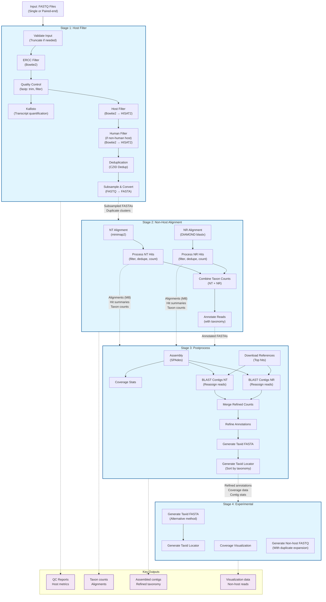

# Short-Read MNGS Workflow Diagram

## Workflow Overview

The Short-Read MNGS (Metagenomic Next-Generation Sequencing) workflow consists of four sequential stages:

### Stage 1: Host Filter
- **Purpose**: Remove host and human sequences, perform quality control
- **Key operations**: ERCC filtering, quality trimming, host/human alignment filtering, deduplication, subsampling
- **Output**: Clean, non-host FASTA sequences ready for microbial analysis

### Stage 2: Non-Host Alignment
- **Purpose**: Identify microbial sequences through database alignment
- **Key operations**: Nucleotide alignment (NT database), protein alignment (NR database), taxonomic classification
- **Output**: Taxonomic assignments and abundance counts

### Stage 3: Postprocess
- **Purpose**: Refine taxonomic assignments through assembly
- **Key operations**: De novo assembly, contig-based realignment, refined taxonomic assignment
- **Output**: High-confidence taxonomic assignments and assembled contigs

### Stage 4: Experimental
- **Purpose**: Generate additional outputs and visualizations
- **Key operations**: Coverage visualization, non-host FASTQ generation
- **Output**: Visualization data and processed read files

## Key Features

- **Dual alignment strategy**: Both nucleotide (minimap2) and protein (DIAMOND) searches
- **Assembly-based refinement**: Uses SPAdes assembly to improve taxonomic assignments
- **Comprehensive filtering**: ERCC, host, human, quality, and complexity filters
- **Duplicate tracking**: Maintains duplicate cluster information throughout pipeline
- **Flexible output formats**: Supports various downstream analyses

## Usage

This workflow is designed to run locally using the `local_driver.wdl` file, which orchestrates all four stages in sequence. Each stage can also be run independently in the production environment.